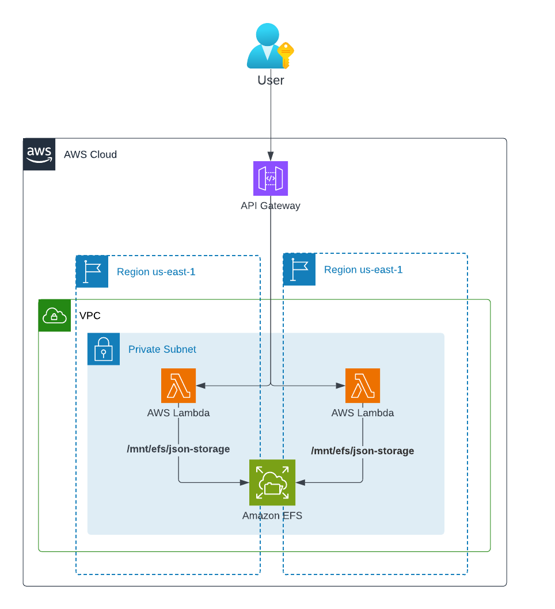

# API de Almacenamiento JSON - Serverless con Terraform

Este proyecto implementa una versión serverless de la API de almacenamiento JSON utilizando AWS Lambda, API Gateway y EFS.

## Arquitectura



- **API Gateway**: Endpoint REST API con autenticación por API Key
- **Lambda**: Cómputo serverless para la lógica de la API (Python 3.11)
- **EFS**: Almacenamiento compartido y persistente para documentos JSON
- **VPC**: Aislamiento de red con subredes privadas en múltiples zonas de disponibilidad

## Características

- ✅ Alta disponibilidad (Multi-AZ)
- ✅ Escalado automático
- ✅ Sin servidores que administrar
- ✅ Límites de uso y rate limiting
- ✅ API Keys para autenticación
- ✅ Almacenamiento persistente con EFS

## Prerrequisitos

- AWS CLI configurado con las credenciales apropiadas
- Terraform >= 1.0
- Cuenta de AWS con permisos para crear:
  - VPC, Subnets, Security Groups
  - Funciones Lambda
  - API Gateway
  - Sistemas de archivos EFS
  - Roles y políticas IAM

## Despliegue

1. Clonar el repositorio:
   ```bash
   git clone <repository-url>
   cd terraform-serverless
   ```

2. Configurar las variables (si es necesario modificar los valores por defecto):
   ```bash
   # El archivo terraform.tfvars ya está configurado con:
   # - Región: us-east-1
   # - Nombre del proyecto: json-storage
   # - VPC CIDR: 10.0.0.0/16
   # - Stage: prod
   ```

3. Inicializar Terraform:
   ```bash
   terraform init
   ```

4. Revisar el plan de despliegue:
   ```bash
   terraform plan
   ```

5. Desplegar la infraestructura:
   ```bash
   terraform apply -auto-approve
   ```

## Endpoints de la API

Después del despliegue, Terraform mostrará la URL de API Gateway y la API Key. Los endpoints disponibles son:

- `GET /`: Mensaje de bienvenida con lista de endpoints
- `GET /health`: Verificación de salud del servicio
- `POST /json`: Crear nuevo documento JSON (requiere API key)
- `GET /json/{id}`: Obtener documento JSON por ID
- `PUT /json/{id}`: Actualizar documento JSON (requiere API key)
- `DELETE /json/{id}`: Eliminar documento JSON (requiere API key)

## Ejemplos de Uso

```bash
# Obtener URL de la API y API Key desde la salida de Terraform
API_URL=$(terraform output -raw api_gateway_url)
API_KEY=$(terraform output -raw api_key_value)

# Verificación de salud (no requiere API key)
curl $API_URL/health

# Página principal (no requiere API key)
curl $API_URL/

# Crear un documento (requiere API key)
curl -X POST $API_URL/json \
  -H "x-api-key: $API_KEY" \
  -H "Content-Type: application/json" \
  -d '{
    "data": {
      "nombre": "Juan",
      "edad": 30,
      "ciudad": "Madrid"
    }
  }'

# Obtener un documento (no requiere API key)
curl $API_URL/json/{document-id}

# Actualizar un documento (requiere API key)
curl -X PUT $API_URL/json/{document-id} \
  -H "x-api-key: $API_KEY" \
  -H "Content-Type: application/json" \
  -d '{
    "data": {
      "nombre": "Juan",
      "edad": 31,
      "ciudad": "Barcelona"
    }
  }'

# Eliminar un documento (requiere API key)
curl -X DELETE $API_URL/json/{document-id} \
  -H "x-api-key: $API_KEY"
```

## Estructura del Proyecto

```
terraform-serverless/
├── main.tf                 # Configuración principal
├── variables.tf            # Definición de variables
├── outputs.tf              # Salidas del despliegue
├── provider.tf             # Configuración del proveedor AWS
├── terraform.tfvars        # Valores de las variables
├── lambda_code/
│   └── lambda_handler.py   # Código de la función Lambda
└── modules/
    ├── vpc/                # Módulo de red
    ├── efs/                # Módulo de almacenamiento
    ├── lambda/             # Módulo de función Lambda
    └── api_gateway/        # Módulo de API Gateway
```

## Límites y Cuotas

La API incluye límites de uso configurados:
- **Rate limit**: 100 peticiones/segundo (burst: 200)
- **Cuota mensual**: 10,000 peticiones
- **Timeout Lambda**: 30 segundos
- **Memoria Lambda**: 512 MB
- **Retención de logs**: 7 días

## Limpieza

Para destruir todos los recursos:
```bash
terraform destroy -auto-approve
```

## Optimización de Costos

Esta arquitectura serverless proporciona beneficios de costos:
- Sin instancias EC2 inactivas
- Lambda cobra solo por el uso real (ms de ejecución)
- EFS con políticas de ciclo de vida para acceso poco frecuente
- Sin costos de NAT Gateway
- API Gateway cobra por petición

## Notas de Seguridad

- Las funciones Lambda se ejecutan en subredes privadas
- El acceso a EFS está restringido al security group de Lambda
- Autenticación de API mediante API Keys de AWS API Gateway
- Las API Keys incluyen planes de uso con limitación de velocidad
- EFS encriptado en reposo
- Roles IAM con permisos mínimos necesarios
- Para producción, considerar usar AWS Cognito o autorizadores personalizados

## Solución de Problemas

### Error: "Mount targets are not supported in subnet's availability zone"
- Algunas zonas de disponibilidad no soportan EFS
- El código ya excluye la zona problemática (use1-az3)

### Error: "API Stage not found"
- Asegurarse de que el API Gateway stage se crea correctamente
- El código ya utiliza el recurso `aws_api_gateway_stage` separado

### La Lambda no puede acceder a EFS
- Verificar que los mount targets de EFS estén en estado "available"
- El código incluye las dependencias necesarias

## Monitoreo

- CloudWatch Logs: `/aws/lambda/json-storage-api`
- Métricas de Lambda disponibles en CloudWatch
- Métricas de API Gateway disponibles en CloudWatch
- Monitoreo de EFS en la consola de AWS

## Contribuir

1. Fork el proyecto
2. Crear una rama de feature (`git checkout -b feature/nueva-caracteristica`)
3. Commit los cambios (`git commit -am 'Agregar nueva característica'`)
4. Push a la rama (`git push origin feature/nueva-caracteristica`)
5. Crear un Pull Request